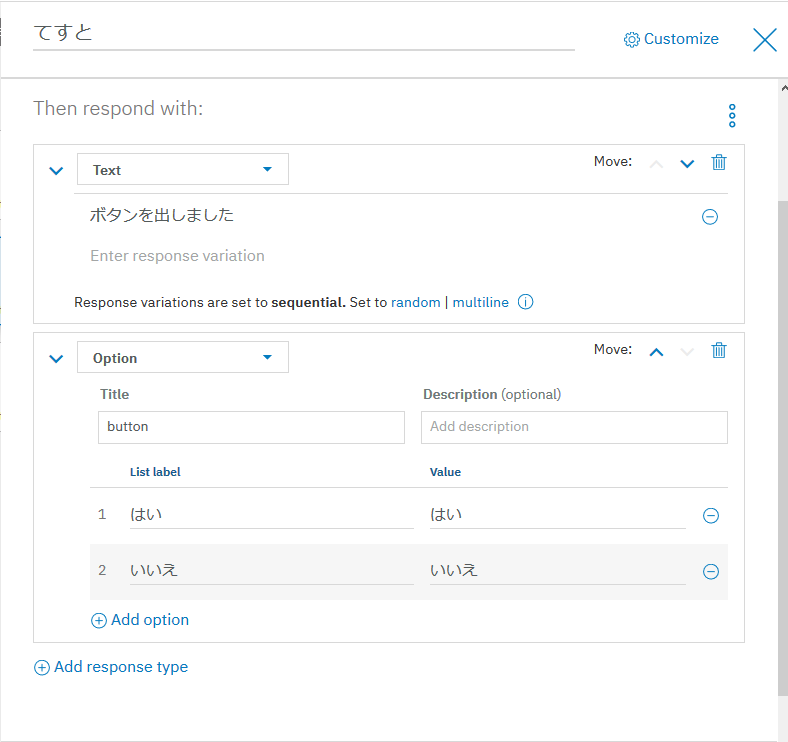

# Flask Web Application with IBM Watson Conversation

## 環境

* Watson + Flask + BotUI

#### ログイン

* pip install flask-login

#### Watson API

* pip install --upgrade "watson-developer-cloud>=1.4.0"

## 仕様

### 設定ファイルに

Watson Assistant APIの接続情報設定

### Watson-Flask

* DialogにてTitle='button'のOptionを作成するとボタンが表示される。

### Flask-javascript

GETで転送
* javascript -> Flask : text
* Flask -> javascript : Json

## SSL対応

Blumixでは不要。一応オンプレでできるようにオレオレ証明書での動作確認済み。